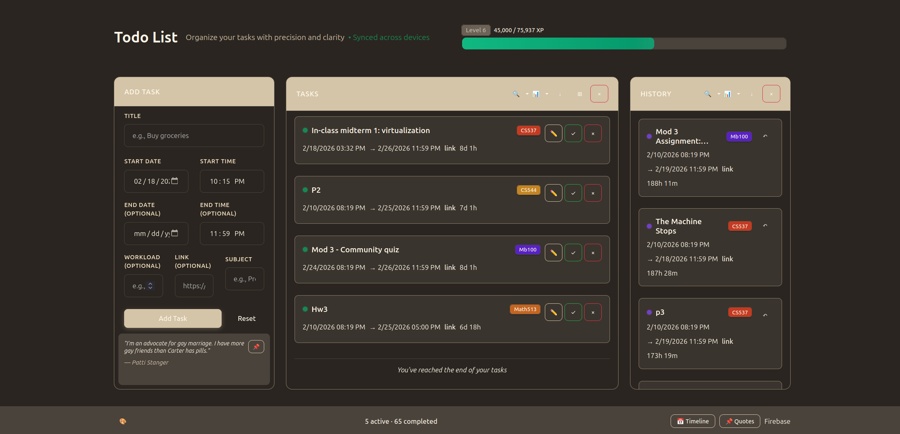
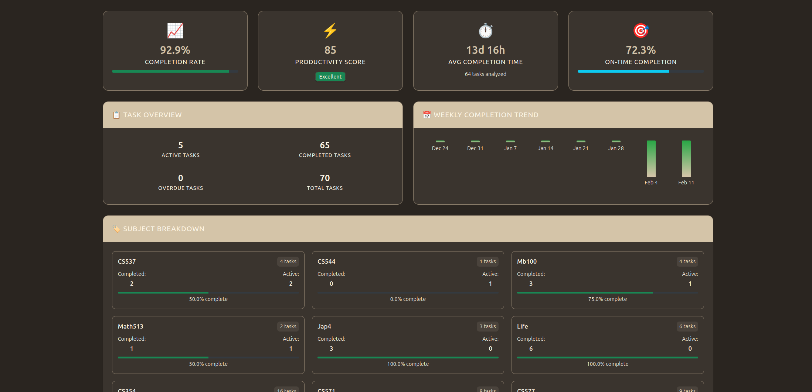
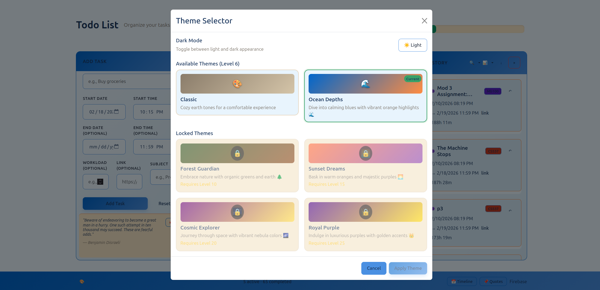

# Todo App

A React + TypeScript productivity app for managing tasks, tracking progress, and exploring timeline/quotes views.

## Quick Start

```bash
cd app
npm install
npm run dev
```

## Project Structure

- `app/` – Vite React application source.
- `docs/FIREBASE_SETUP.md` – Firebase setup guide.
- `docs/screenshots/` – Reserved folder for app screenshots.

## Screenshots



